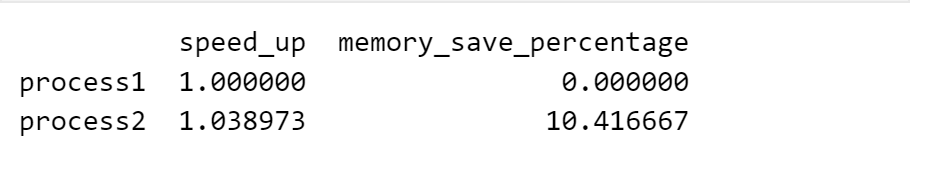
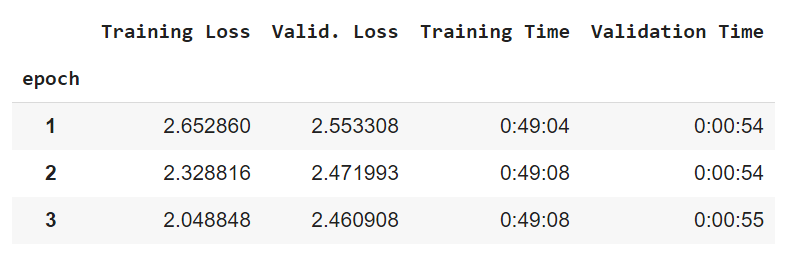
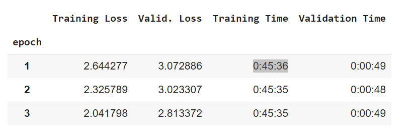
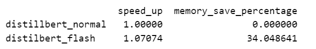

# Flash Attention with BetterTransformer
BetterTransformer hỗ trợ fastpath từ nn.TransformerEncoderLayer và Flash Attention và Memory-Efficient Attention từ torch.nn.functional.scaled_dot_product_attention.

Để có thể sử dụng BetterTransformer, ta cần cài đặt package optimum từ huggingface:
```
pip install optimum
pip install transformers
```

Example use:
```
from optimum.bettertransformer import BetterTransformer
from transformers import AutoModelForCausalLM

model_hf = AutoModelForSequenceClassification.from_pretrained("bert-base-cased")
model = BetterTransformer.transform(model_hf, keep_original_model=True)
```

Note: Không thể lưu lại model sau khi đã transform. Nếu muốn lưu lại model sau khi train ta có thể 'reverse' lại model :
```
model = BetterTransformer.reverse(model)
model.save_pretrained(“fine_tuned_model”)
model.push_to_hub(“fine_tuned_model”) 
```

Để chắc chắn rằng sử dụng flash attention, ta có thể sử dụng context manager:
```
torch.backends.cuda.sdp_kernel:
    code with transformer...
```


## Thử nghiệm:
## model: gpt2 , dataset: [wikitext](https://huggingface.co/datasets/wikitext/viewer/wikitext-2-raw-v1) 

#### Run on [colab](../notebook/gpt2_wiki_2.ipynb) or [alter](https://colab.research.google.com/drive/11OpCKeOj0XoNt1XPsrnrF2qCPDzmn2kn#scrollTo=k8KPQp_DUSMe) , logging by [wandb](https://wandb.ai/htx_ai_101/gpt2_wiki_2?workspace=user-pepoo20) 

hyperarmeters : seq_len = 128,batch_size = 8 


## model: gpt2 , dataset: [wikisource](https://huggingface.co/datasets/wikimedia/wikisource/viewer/20231201.en)
Run on [colab](../notebook/gpt2_wikisource.ipynb) or [alter](https://colab.research.google.com/drive/1eVPz_NZhUoEOmKkwn3Hvf3-cTIc2H2xN?usp=sharing) , logging by [wandb](https://wandb.ai/htx_ai_101/gpt2_wiki_v1)


hyperarmeters : seq_len = 128,batch_size = 32
   

## model: gpt2 , dataset: [wikisource](https://huggingface.co/datasets/wikimedia/wikisource/viewer/20231201.en) 
Run on [colab](../notebook/gpt2_wiki_langua_float16.ipynb) or [alter](https://colab.research.google.com/drive/14JfxqBp8779X9JIh9cH29gbNC28trf9U?usp=sharing) , logging by [wandb](https://wandb.ai/htx_ai_101/gpt2_wiki?workspace=user-pepoo20)   
hyperameters: seq_len = 512, batch_size = 4, dtype = torch.float16
  


But the validation loss got affected.   
Normal:


Flash:



## model : distilbert-base-uncased, dataset: [wikitext](https://huggingface.co/datasets/wikitext/viewer/wikitext-2-raw-v1)

Run on [colab](../notebook/distilBertwiki.ipynb) or [alter](https://colab.research.google.com/drive1MsebVKnBZGLpfysgUL3MysM27tdl-qfJ?usp=sharing) , logging by [wandb](https://wandb.ai/htx_ai_101/distilbert_wiki)  

hyperarmeters : seq_len = 128,batch_size = 8 (default huggingface)


