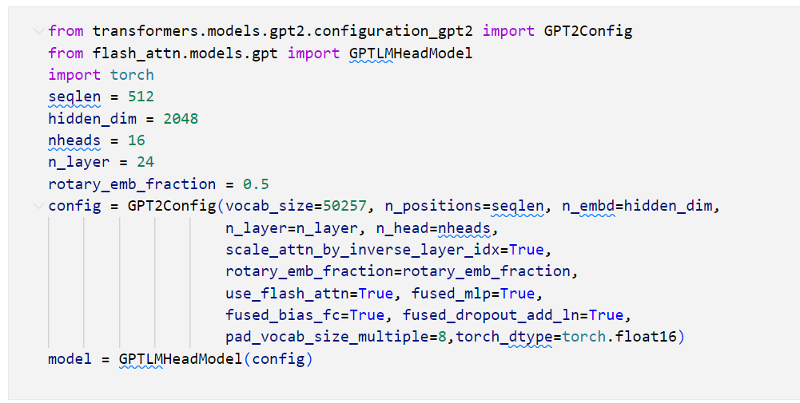

# Vanila Flash Experiment

## Latest Version of flash_attention   (2.5)
Có thể cài đặt package với lệnh :
`` pip install flash_attn ``  
Note && requirement : Pytorch, packaging,ninja (`ninja
--version` then `echo $?` should return exit code 0)  

Hiện tại hỗ trợ  :

1. Ampere, Ada, or Hopper GPUs (e.g., A100, RTX 3090, RTX 4090, H100). Support for Turing
   GPUs (T4, RTX 2080) is coming soon, please use FlashAttention 1.x for Turing
   GPUs for now.
2. Datatype fp16 and bf16 (bf16 requires Ampere, Ada, or Hopper GPUs).
3. All head dimensions up to 256. Head dim > 192 backward requires A100/A800 or H100/H800.

### Thử nghiệm với colab T4 với mô hình GPT2 và bộ data wikisource ([colab](../notebook/flash_GPT2_wiki_lightning.ipynb))

Có thể build được model sử dụng FlashAttention theo hướng dẫn của repo gốc



Gặp lỗi với colab 
` AssertionError: libcuda.so cannot found!`

Dựa vào [thread](https://github.com/pytorch/pytorch/issues/107960)
Có thể fix bằng 
```
!export LC_ALL="en_US.UTF-8"
!export LD_LIBRARY_PATH="/usr/lib64-nvidia"
!export LIBRARY_PATH="/usr/local/cuda/lib64/stubs"
!ldconfig /usr/lib64-nvidia
```
Sau đó gặp lỗi không đúng type của tensor
```
/usr/local/lib/python3.10/dist-packages/flash_attn/modules/mha.py in forward(self, qkv, causal, cu_seqlens, max_seqlen)
     89                 else (B, S, H, D).
     90         """
---> 91         assert qkv.dtype in [torch.float16, torch.bfloat16]
     92         assert qkv.is_cuda
     93         causal = self.causal if causal is None else causal

AssertionError: 
```

Thử sửa lại type của tensor thành float16 với 
`` .to(torch.float16)``

Gặp lỗi không đúng type của tensor ở embedding layer
```
/usr/local/lib/python3.10/dist-packages/torch/nn/functional.py in embedding(input, weight, padding_idx, max_norm, norm_type, scale_grad_by_freq, sparse)
   2231         # remove once script supports set_grad_enabled
   2232         _no_grad_embedding_renorm_(weight, input, max_norm, norm_type)
-> 2233     return torch.embedding(weight, input, padding_idx, scale_grad_by_freq, sparse)
   2234 
   2235 

RuntimeError: Expected tensor for argument #1 'indices' to have one of the following scalar types: Long, Int; but got torch.cuda.HalfTensor instead (while checking arguments for embedding)
```

## Version 1.9 - flash_attention 1 support Turing GPUs (T4)

Có thể cài đặt package với lệnh :
`` pip install flash-attn==1.0.9  ``  
Note : Việc cài đặt lâu hơn so với version 2.5 do chưa hỗ trợ build wheel với packaging và ninja 
Tốn khoảng 15 phút để build so với 3 phút của version 2.5

Để có thể build được model sử dụng FlashAttention theo hướng dẫn của repo gốc cần phải cài thêm các pakage cuda sau :
```
    cd ../csrc/fused_dense_lib && pip install .
    cd ../csrc/xentropy && pip install .
    cd ../csrc/rotary && pip install .
    cd ../csrc/layer_norm && pip install .
```

3 package đầu có thể build được mặc dù khá lâu, riêng package cuối cùng layer_norm tốn quá nhiều thời gian nên không thể build được dù cho session colab time out.


